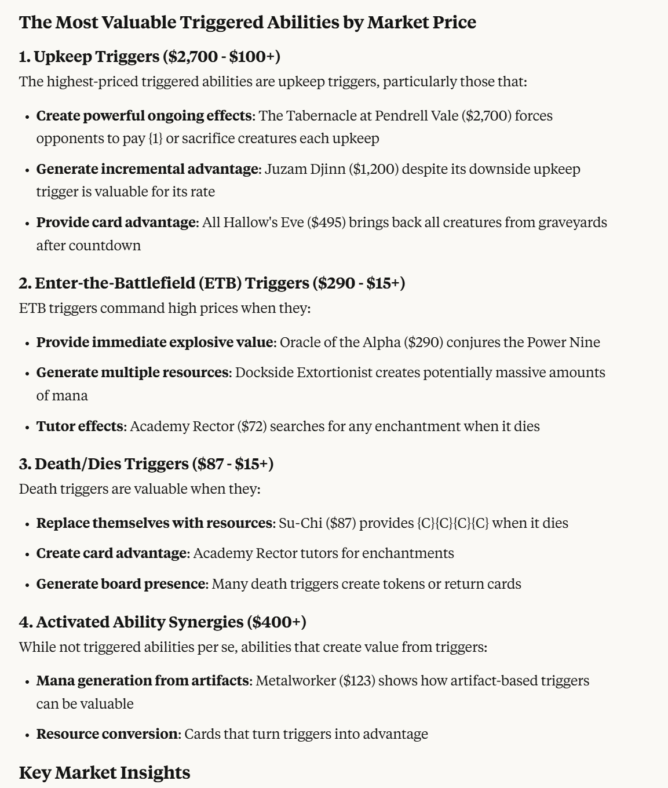

# Scryfall MCP Server

A Model Context Protocol (MCP) server for querying Magic: The Gathering card information from the Scryfall API with enhanced natural language support.

Natural Langauge part needs improvement to better help the LLM communicate with Scryfall, will update as its used.

Sample queries
```
I'd liek to know which are the most valuable types of triggers in MTG based on the MCP to value
```



## Features

### 🎯 Natural Language Search
- **Smart Translation**: Automatically translates natural language queries like "red creatures that sacrifice" into proper Scryfall syntax
- **Fallback Support**: Regular search tools automatically attempt natural language translation if exact queries fail
- **Comprehensive Mappings**: Supports hundreds of common MTG terms and phrases
- **MTG Knowledge Integration**: Leverages comprehensive MTG terminology database for better understanding

### 🧠 MTG Knowledge Base
- **Comprehensive Terminology**: Built-in knowledge of card types, keyword abilities, color combinations, formats, and deck archetypes
- **Context-Aware Suggestions**: Provides relevant MTG information and related search suggestions
- **Educational Support**: Learn about MTG concepts with detailed explanations and examples
- **Smart Term Recognition**: Automatically identifies and explains MTG terms in your queries

### 🔍 Search Capabilities
- **Card Search**: Find cards using exact Scryfall syntax or natural language
- **Named Card Lookup**: Get specific cards by exact or fuzzy name matching
- **Random Cards**: Get random cards with optional filtering
- **Autocomplete**: Get card name suggestions
- **Advanced Filtering**: Filter by type, color, set, format legality, price, and more

### 💰 Pricing Integration
- **TCGPlayer Prices**: Detailed pricing from TCGPlayer
- **Card Kingdom Prices**: Pricing information from Card Kingdom
- **Multiple Price Points**: Market, low, mid, high, and direct prices
- **Combined Pricing**: Get card info with pricing from multiple sources

### Educational Tools
- **Search Help**: Comprehensive documentation of Scryfall search syntax
- **Translation Help**: Learn how natural language maps to Scryfall syntax
- **MTG Knowledge Lookup**: Get detailed information about any MTG term or concept
- **Examples**: Extensive examples for complex queries

## Natural Language Examples

The server can understand and translate queries like:

- **"red creatures with flying"** → `c:r t:creature o:flying`
- **"cheap blue counterspells"** → `c:u o:"counter" and o:"spell" cmc<=2`
- **"angels that enter the battlefield"** → `t:angel o:"enters the battlefield"`
- **"sacrifice outlets"** → `o:"sacrifice" or o:"sac a" or o:"sac an"`
- **"expensive modern legal cards"** → `legal:modern usd>=50`
- **"token generators"** → `o:"create" and o:"token"`

## Available Tools

### Primary Search Tools
- `scryfall_natural_search` - Search using natural language (recommended)
- `scryfall_search_cards` - Traditional Scryfall syntax search with NL fallback
- `scryfall_get_card_named` - Find specific cards by name

### Utility Tools
- `scryfall_translation_help` - Learn natural language mappings
- `scryfall_search_help` - Complete Scryfall syntax documentation
- `scryfall_autocomplete` - Get card name suggestions
- `mtg_knowledge_lookup` - Comprehensive MTG terminology and rules reference

### Specialized Tools
- `scryfall_get_random_card` - Random card generator
- `scryfall_card_with_all_prices` - Card info with comprehensive pricing
- `scryfall_get_all_cards_in_set` - Browse entire sets
- `scryfall_get_cards_by_type` - Filter by creature types, card types, etc.
- `scryfall_get_cards_with_text` - Search by oracle text or names

## Installation

```bash
npm install
npm run build
```

## Usage

This is an MCP server designed to be used with MCP-compatible clients. The server runs on stdio and provides tools for querying Magic: The Gathering card data with intelligent natural language processing.

## Natural Language Mapping Categories

- **Text & Abilities**: enters/leaves battlefield, sacrifice, destroy, flying, etc.
- **Colors**: All color names, guild names, color combinations
- **Types**: Creatures, spells, artifacts, specific creature types
- **Formats**: Standard, Modern, Legacy, Commander, Pioneer, etc.
- **Costs**: Cheap, expensive, specific mana costs, budget ranges

## License

MIT
